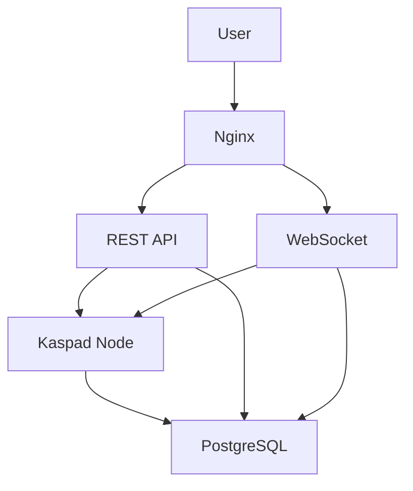

# Kaspa Node Deployment

## Project Overview
This repository contains Docker and Kubernetes configurations for deploying a Kaspa node with:
- Kaspad node (mainnet/testnet)
- REST API server
- WebSocket server
- PostgreSQL database
- Transaction indexer
- Nginx reverse proxy

## Architecture


## Setup Instructions

### Mainnet Deployment
```bash
docker-compose -f docker-compose-mainnet.yml up -d
```

Services:
- Kaspa Explorer: http://localhost:8080
- REST API: http://localhost:8000
- WebSocket: ws://localhost:8001/ws/
- Kaspad RPC: localhost:16110 (JSON-RPC), 17110 (Borsh-RPC)

### Testnet Deployment
```bash
docker-compose -f docker-compose-testnet10.yml up -d
```

Services:
- REST API: http://localhost:8000
- WebSocket: ws://localhost:8001/ws/
- Kaspad RPC: localhost:16210 (JSON-RPC), 17210 (Borsh-RPC)

## Configuration

### Environment Variables
- `KASPAD_HOST_1`: Kaspad node connection string
- `SQL_URI`: PostgreSQL connection string
- `NETWORK_TYPE`: "mainnet" or "testnet"
- `TESTNET_SUFFIX`: "10" for testnet-10

### Volumes
- Kaspad data: `/var/kaspad` (mainnet), named volume (testnet)
- PostgreSQL data: `/var/kaspa_db` (mainnet), named volume (testnet)

## API Documentation

### REST API
Base URL: `http://localhost:8000`

Endpoints:
- `/info`: Node information
- `/blocks`: Block data
- `/transactions`: Transaction data

### WebSocket
Endpoint: `ws://localhost:8001/ws/`

Subscribe to:
- New blocks
- Transaction confirmations

## Kubernetes Deployment
For production deployments, see `kaspa-k8s-manifests.yaml` for Kubernetes configurations.

## Maintenance
To stop services:
```bash
docker-compose -f docker-compose-mainnet.yml down
# or
docker-compose -f docker-compose-testnet10.yml down
```

To view logs:
```bash
docker-compose logs -f
